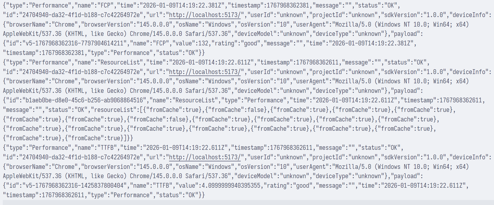

# fe-sentry

- Vue3
- React

## Rollup

```bash
pnpm add rollup -D

pnpm add \
@rollup/plugin-commonjs \
@rollup/plugin-json
@rollup/plugin-node-resolve \
@rollup/plugin-terser \
# @rollup/plugin-typescript \
-D

pnpm add rollup-plugin-esbuild -D
pnpm add rollup-plugin-dts -D

pnpm add tslib -D
```

## package.json

```json
{
  "type": "module",
  // main: cjs 入口
  "main": "./dist/index.cjs",
  // module: esm 入口
  "module": "./dist/index.js",
  // types: ts 类型声明入口
  "types": "./dist/index.d.ts",
  "exports": {
    ".": {
      // exports.types: ts 类型声明入口
      "types": "./dist/index.d.ts",
      // exports.import: esm 入口, 优先级高于 module
      "import": "./dist/index.js",
      // exports.require: cjs 入口, 优先级高于 main
      "require": "./dist/index.cjs"
    }
  },
  // files: 发布到 npm 时包含的文件/目录
  "files": ["dist"],
  "publishConfig": {
    "access": "public"
  }
}
```

## Verify

pnpm-workspace.yaml

```yaml
packages:
  - "packages/*"
  - "resume"
```

Install dependencies

```bash
rm -rf ./resume/pnpm-lock.yaml
pnpm add @fe-sentry/core --filter resume
pnpm add @fe-sentry/performance --filter resume
pnpm add @fe-sentry/screen-record --filter resume
```

Update ./vite.config.ts

```ts
import { defineConfig } from "vite";

export default defineConfig({
  optimizeDeps: {
    // 禁止预构建 workspace 依赖
    exclude: [
      "@fe-sentry/core",
      "@fe-sentry/performance",
      "@fe-sentry/screen-record",
    ],
  },
});
```

Update ./resume/src/main.tsx

```ts
import { init, use } from "@fe-sentry/core";
import PerformancePlugin from "@fe-sentry/performance";
import ScreenRecordPlugin from "@fe-sentry/screen-record";

init({ dsn: "http://127.0.0.1:8080/api/log" });
use(PerformancePlugin);
use(ScreenRecordPlugin);
```

Update ./package.json

```json
{
  "scripts": {
    "dev": "pnpm build && cd ./resume && pnpm dev"
  }
}
```

Update ./resume/index.html

```html
<!doctype html>
<html lang="en">
  <head>
    <meta charset="UTF-8" />
    <link rel="icon" type="image/svg+xml" href="/react.svg" />
    <meta name="viewport" content="width=device-width, initial-scale=1.0" />
    <title>resume</title>
  </head>
  <body>
    <iframe
      title="https://bilibili.com/"
      src="https://bilibili.com/"
      width="100%"
      height="888"
    ></iframe>
    <div id="root"></div>
    <script type="module" src="/src/main.tsx"></script>
  </body>
</html>
```

## Logs


